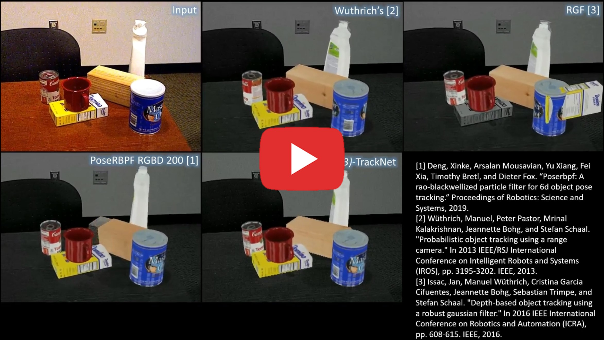
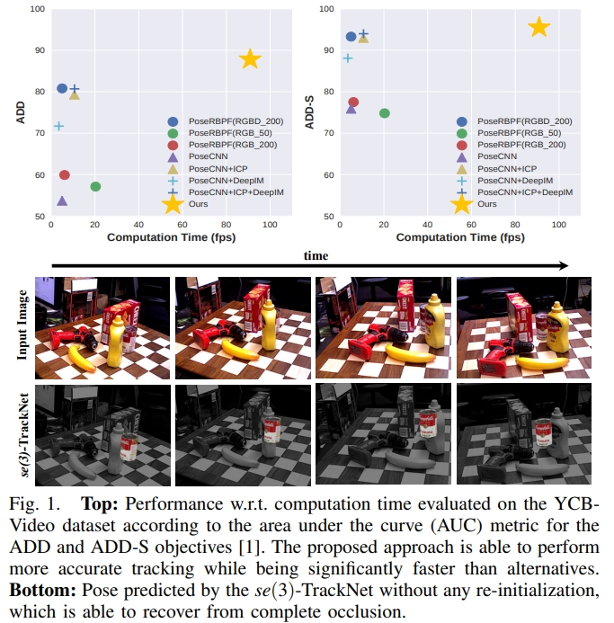
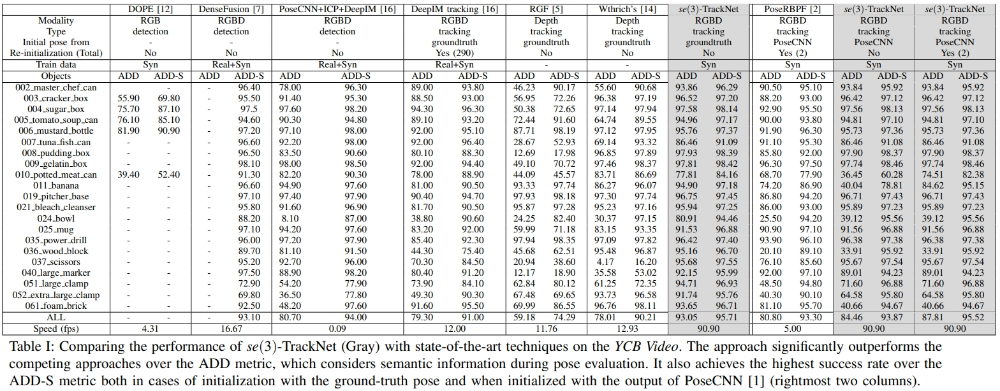
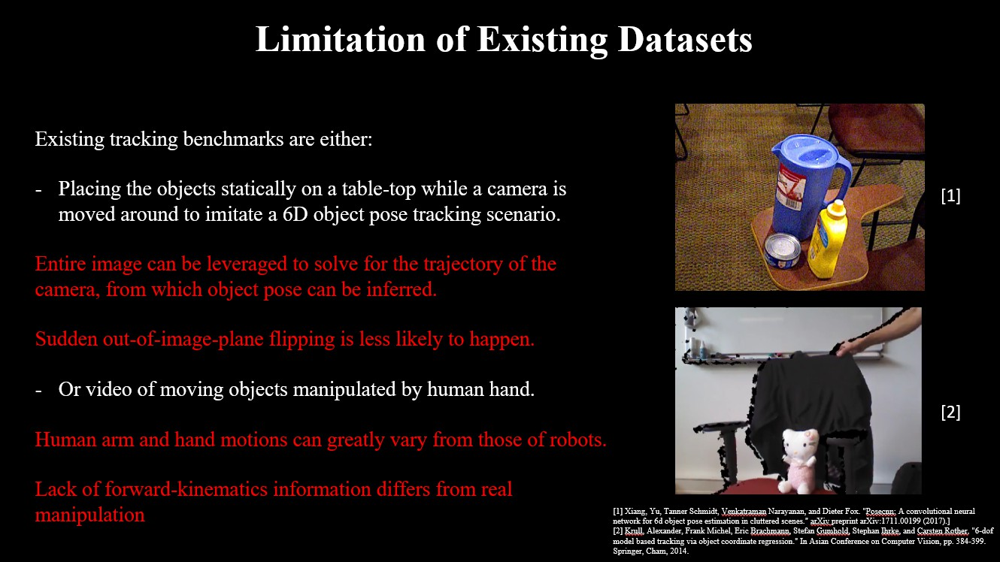
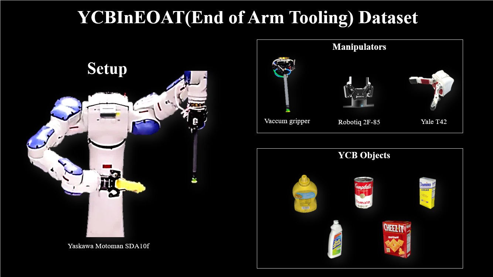
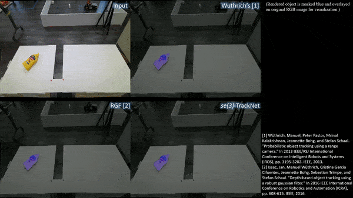
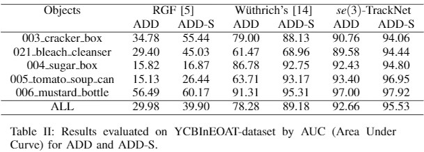
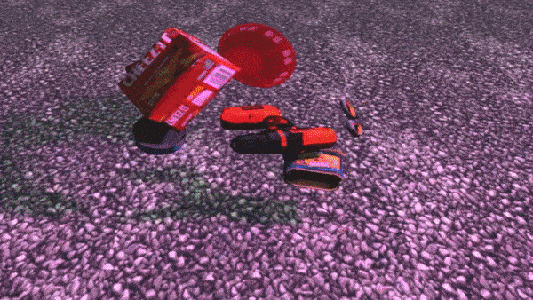
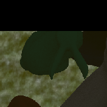

# iros20-6d-pose-tracking

This is the official implementation of our paper "se(3)-TrackNet: Data-driven 6D Pose Tracking by Calibrating Image Residuals in Synthetic Domains" accepted in International Conference on Intelligent Robots and Systems (IROS) 2020.
[[PDF]](https://arxiv.org/abs/2007.13866)

**Abstract:** Tracking the 6D pose of objects in video sequences is important for  robot manipulation. This  task, however, introduces multiple challenges: (i) robot manipulation involves significant occlusions; (ii) data and annotations are troublesome and difficult to collect for 6D poses, which complicates machine learning solutions, and (iii) incremental error drift often accumulates in long term tracking to necessitate re-initialization of the object's pose. This work proposes a data-driven optimization approach for long-term, 6D pose tracking. It aims to identify the optimal relative pose given the current RGB-D observation and a synthetic image conditioned on the previous best estimate and the object's model. The key contribution in this context is a novel neural network architecture, which appropriately disentangles the feature encoding to help reduce domain shift, and an effective 3D orientation representation via Lie Algebra. Consequently, even when the network is trained only with synthetic data can work effectively over real images. Comprehensive experiments over benchmarks - existing ones as well as a new dataset with significant occlusions related to object manipulation - show that the proposed approach achieves consistently robust estimates and outperforms alternatives, even though they have been trained with real images. The approach is also the most computationally efficient among the alternatives and achieves a tracking frequency of 90.9Hz.


**Applications:** model-based RL, manipulation, AR/VR, human-robot-interaction, automatic 6D pose labeling.


**This repo can be used when you have the CAD model of the target object. When such model is not available, checkout our another repo [BundleTrack](https://github.com/wenbowen123/BundleTrack), which can be instantly used for 6D pose tracking of novel unknown objects without needing CAD models**


# Bibtex
```bibtex
@article{wen2020se,
   title={se(3)-TrackNet: Data-driven 6D Pose Tracking by Calibrating Image Residuals in Synthetic Domains},
   url={http://dx.doi.org/10.1109/IROS45743.2020.9341314},
   DOI={10.1109/iros45743.2020.9341314},
   journal={2020 IEEE/RSJ International Conference on Intelligent Robots and Systems (IROS)},
   publisher={IEEE},
   author={Wen, Bowen and Mitash, Chaitanya and Ren, Baozhang and Bekris, Kostas E.},
   year={2020},
   month={Oct} }
```


# (New) Application to visual feedback control

Some example experiments using se(3)-TrackNet in our recent work "Vision-driven Compliant Manipulation for Reliable, High-Precision Assembly Tasks", RSS 2021.


# Supplementary Video:
Click to watch

[](https://www.youtube.com/watch?v=dhqM0hZmGR4)


#  Results on YCB







# About YCBInEOAT Dataset






Due to the lack of suitable dataset about RGBD-based 6D pose tracking in robotic manipulation, a novel dataset is developed in this work. It has these key attributes:

* Real manipulation tasks

* 3 kinds of end-effectors

* 5 YCB objects

* 9 videos for evaluation, 7449 RGBD in total

* Ground-truth poses annotated for each frame

* Forward-kinematics recorded

* Camera extrinsic parameters calibrated

Link to download this dataset is provided below under 'Data Preparation'.
Example manipulation sequence:




Current benchmark:



More details are in the paper and supplementary video.

# Quick setup

- Use docker and pull the pre-built image. ([Install docker](https://docs.docker.com/get-docker/) first if you haven't)
	```
	docker pull wenbowen123/se3_tracknet:latest
	```

- Launch docker container as below and now it's ready to run
   ```
   cd docker
   bash run_container.sh
   ```

# Data Download
- [YCB_Video object models with ply files](https://archive.cs.rutgers.edu/pracsys/se3_tracknet/YCB_models_with_ply.zip)
- [data_organized](https://archive.cs.rutgers.edu/archive/a/2020/pracsys/Bowen/iros2020/YCB_Video_data_organized/) (15G). It is the reorganized YCB_Video data for convenience. Then extract it under your YCB_Video dataset directory, e.g. YCB_Video_Dataset/data_organized/0048/
- [YCBInEOAT dataset](https://archive.cs.rutgers.edu/archive/a/2020/pracsys/Bowen/iros2020/YCBInEOAT/) (22G)
- Our [pretrained weights on YCB_Video](https://archive.cs.rutgers.edu/archive/a/2020/pracsys/Bowen/iros2020/YCB_weights.zip) and [pretrained weights on YCBInEOAT](https://archive.cs.rutgers.edu/archive/a/2020/pracsys/Bowen/iros2020/YCBInEOAT_weights.zip)
- Our generated [synthetic YCB_Video training data](https://archive.cs.rutgers.edu/archive/a/2020/pracsys/Bowen/iros2020/YCB_traindata/) (~15G for each object) and  [synthetic YCBInEOAT trainnig data](https://archive.cs.rutgers.edu/archive/a/2020/pracsys/Bowen/iros2020/YCBInEOAT_traindata/) (~15G for each object)




- [se(3)-TrackNet's output pose estimations of YCB_Video](https://archive.cs.rutgers.edu/archive/a/2020/pracsys/Bowen/iros2020/Ours_YCB_results.tar.gz) and [se(3)-TrackNet's output pose estimations of YCBInEOAT](https://archive.cs.rutgers.edu/pracsys/se3_tracknet/YCBInEOAT_results/)


# Test on YCB_Video and YCBInEOAT datasets
Please refer to `predict.py` and `predict.sh`

# Benchmarking
Please refer to `eval_ycb.py` and `eval_ycbineoat.py`


# Training
1. Edit the config.yml. Make sure the paths are correct. Other settings need not be changed in most cases.
1. Then  `python train.py`


# Generate your own data
Here we take `object_models/bunny` as an exmaple, you need to prepare your own CAD models like it for new objects.

- [Download the blender file](https://archive.cs.rutgers.edu/pracsys/se3_tracknet/1.blend) and put it inside this repository folder

- Edit `dataset_info.yml`. The params are self-explained. In particular, add the object model, e.g. `/home/se3_tracknet/object_models/bunny/1.ply` in our example.

-  Start generation, it should save to `/home/se3_tracknet/generated_data/`
   ```
   python blender_main.py
   ```

- Generate paired data as neighboring images, it should save to `/home/se3_tracknet/generated_data_pair/`
   ```
   python produce_train_pair_data.py
   ```

   Example pair:
   <p float="left">
      
      
   </p>


- Now refer to the `Training` section.


# Test in the wild with ROS
```
python predict_ros.py
```

For more information
```
python predict_ros.py --help
```